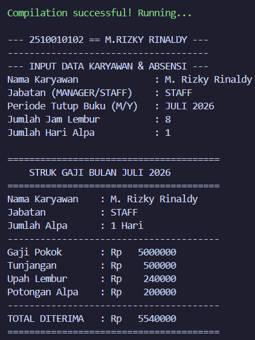
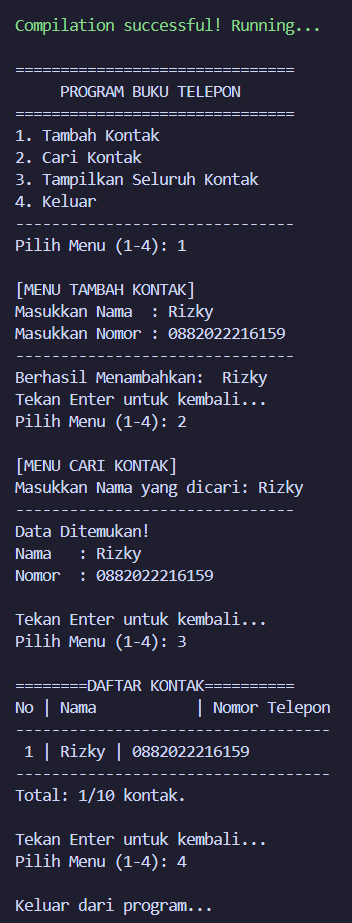
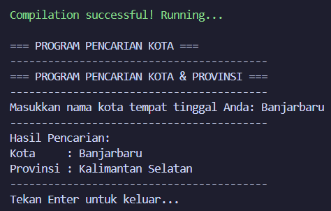
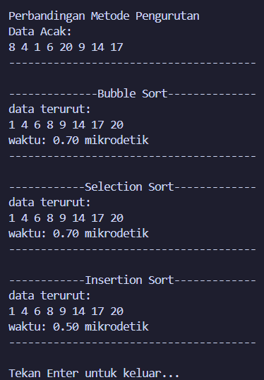
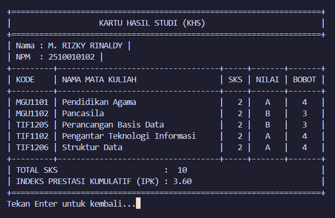
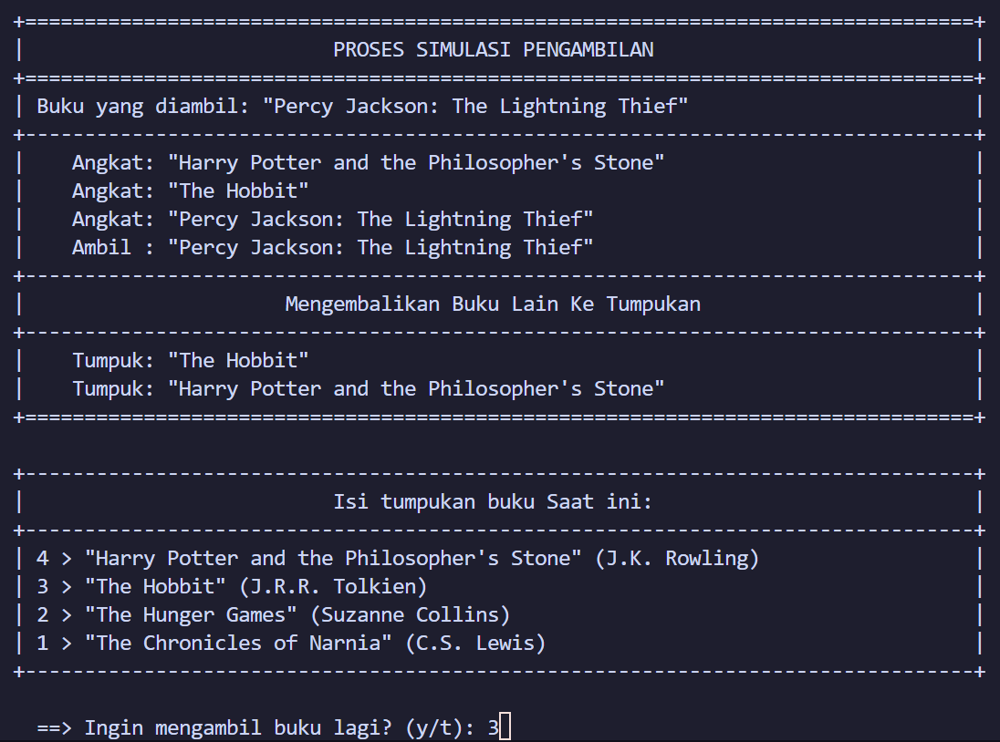
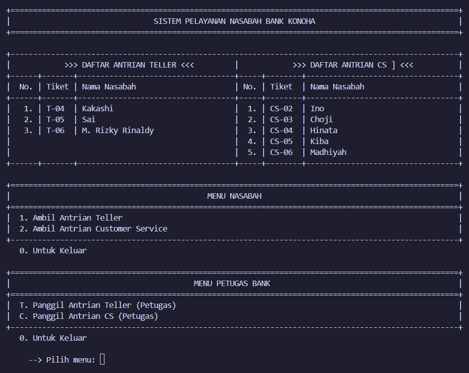
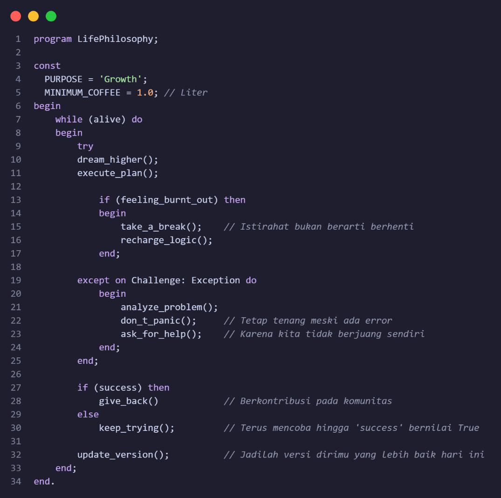
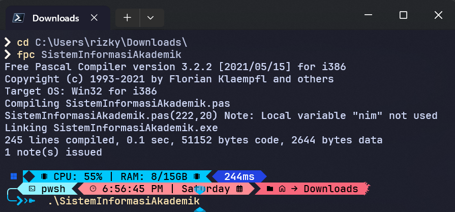

<!--  -->


Repositori ini merupakan kumpulan tugas kuliah, latihan praktikum, dan proyek ujian untuk mata kuliah berbasis bahasa pemrograman, **Python**, **Pascal**, dll (seperti Algoritma & Pemrograman dan Struktur Data). Semua kode di dalam repositori ini dibuat untuk memenuhi tugas akademik di program studi Informatika/Sistem Informasi.


---

## 📝 Identitas Mahasiswa
* **Nama** : M. Rizky Rinaldy
* **NPM** : 2510010102
* **Program Studi** : Teknik Informatika

### 📊 Statistik Repositori
<p align="center">
  
  
</p>

---

## 🗂️ Daftar Tugas

Di bawah ini adalah daftar program Pascal yang telah digabungkan ke dalam repositori ini:

<table>
  <tr>
    <td width="60%">
      <h3>💵 Program Sistem Gaji Bulanan (<code>./ProgramSistemGaji</code>)</h3>
      <ul>
        <li><b>Mata Kuliah:</b> Struktur Data</li>
        <li><b>Konsep:</b> Entitas Single Record (Struct tunggal), Parameter Referensi (var), Fungsi Pengembalian Nilai (User-Defined Functions), Konstanta Global, dan Pemformatan Keuangan Desimal (:10:0).</li>
      <li><b>Fitur Utama:</b> 
        <details>
          <summary><b>🔍 Klik untuk melihat detail fitur program</b></summary>
          <ul>
            <li><b>Parameter Referensi / Pass-by-Reference (var):</b> Prosedur <code>TentukanJabatan</code> menggunakan kata kunci var pada parameternya. Konsep ini membuat perubahan nilai GajiPokok dan Tunjangan di dalam prosedur langsung mengubah data asli pada variabel K di program utama secara permanen.</li>
            <li><b>Fungsi Modular Aljabar Finansial (Modular Return Functions):</b> Menggunakan dua fungsi matematika mandiri: <code>HitungPotonganAlpa</code> dan <code>HitungTotalGaji</code>. Pemisahan ini mempermudah proses pemeliharaan kode jika sewaktu-waktu rumus kebijakan penggajian internal kampus atau perusahaan berubah.</li>
            <li><b>Generator Struk Gaji Konsol Elektrik:</b> Melalui prosedur <code>TampilkanStruk</code>, sistem mampu mencetak slip gaji bulanan yang rapi dan informatif, memetakan seluruh komponen pemasukan (Upah Lembur via konstanta <code>TARIF_LEMBUR = 30000</code>), komponen pengurangan, hingga kalkulasi bersih total uang yang diterima karyawan.</li>
          </ul>
        </details>
        </li>
      </ul>
    </td>
    <td width="40%">
      
    </td>
  </tr>
  <tr>
    <td width="60%">
      <h3>📞 Program Buku Telepon (<code>./ProgramBukuTelepon</code>)</h3>
      <ul>
        <li><b>Mata Kuliah:</b> Struktur Data</li>
        <li><b>Konsep:</b> Larik Paralel (Parallel Arrays), Manajemen Penunjuk Indeks (Index Pointer), Operasi Append Array, Pencarian Sekuensial (Sequential Search), dan Penanganan Batas Memori (Overflow Handling).</li>
        <li><b>Fitur:</b> 
        <details>
          <summary><b>🔍 Klik untuk melihat detail fitur program</b></summary>
            <ul>
                <li><b>Mekanisme Penambahan Elemen (Append Operation):</b> Prosedur <code>AppendContact</code> menyisipkan elemen baru secara berurutan dari kiri ke kanan. Penambahan data selalu ditaruh pada posisi indeks terakhir yang aktif, yang didahului oleh operasi increment (<code>jumlahNomor := jumlahNomor + 1</code>).</li>
                <li><b>Pencarian Linear dengan Proteksi Karakter (Linear Search with Normalization):</b> Prosedur <code>SearchContact</code> menerapkan pencarian berurutan satu per satu. Untuk meminimalkan kesalahan pencarian akibat penulisan pengguna, sistem menormalisasi string nama pembanding ke bentuk huruf kapital menggunakan fungsi <code>upcase()</code>.</li>
                <li><b>Pencegahan Kelebihan Kapasitas (Overflow Handling):</b> Sistem memiliki mekanisme keamanan memori. Sebelum proses penambahan kontak dilakukan, program akan mengecek kondisi <code>if jumlahNomor < BATAS_INPUT</code> untuk mencegah runtime error akibat indeks melampaui batas (array out of bounds).</li>
                <li><b>Laporan Kerapian Format Tabel (Formatted Padding):</b> Prosedur <code>ViewAllContacts</code> mampu memvisualisasikan seluruh riwayat data kontak secara terstruktur. Fitur ini memanfaatkan teknik width formatting bawaan Pascal (<code>nama[i]:-14</code> dan <code>i:2</code>) untuk memaksa kolom teks bergeser rata kiri (left alignment) dan nomor indeks rata kanan, dilengkapi baris rangkuman rasio sisa memori (Total: X/10 kontak).</li>
            </ul>
        </details>
        </li>
      </ul>
    </td>
    <td width="40%">
      
    </td>
  </tr>
  <tr>
    <td width="60%">
      <h3>🏙️ Program Data Kota (<code>./ProgramDataKota</code>)</h3>
      <ul>
        <li><b>Mata Kuliah:</b> Struktur Data</li>
        <li><b>Konsep:</b> Larik Paralel (Parallel Arrays), Pencarian Linear (Sequential/Linear Search), Optimasi Early Exit (break), dan Normalisasi String (upcase).</li>
        <li><b>Fitur:</b> 
        <details>
          <summary><b>🔍 Klik untuk melihat detail fitur program</b></summary>
            <ul>
                <li><b>Pencarian Linear (Sequential Search):</b> Algoritma pencarian dasar yang memeriksa data satu per satu dari indeks pertama (i = 1) hingga indeks terakhir (MAKS_DATA). Jika data yang dicari berada di awal, prosesnya akan sangat cepat.</li>
                <li><b>Pencarian Kebal Huruf Kapital (Case-Insensitive Match):</b> Menggunakan fungsi bawaan upcase() pada kedua sisi perbandingan (<code>upcase(arrKota[i]) = upcase(cariKota)</code>). Ini mencegah kegagalan pencarian akibat perbedaan pengetikan user (misal: 'banjarmasin', 'BANJARMASIN', atau 'Banjarmasin' akan dianggap sama).</li>
                <li><b>Sistem Pencarian Riil Berbasis Penanda (Flagging System):</b> Menggunakan variabel boolean ketemu sebagai indikator hasil. Jika hingga akhir perulangan nilai ketemu tetap <code>false</code>, sistem secara dinamis akan memicu penanganan error (error handling) yang menginformasikan bahwa kota tersebut belum terdaftar.</li>
            </ul>
        </details>
        </li>
      </ul>
    </td>
    <td width="40%">
      
    </td>
  </tr>
  <tr>
    <td width="60%">
      <h3>🔢 Program Pengurutan Array (<code>./ProgramPengurutanArray</code>)</h3>
      <ul>
        <li><b>Mata Kuliah:</b> Struktur Data</li>
        <li><b>Konsep:</b> Algoritma Pengurutan (Sorting Algorithms), Benchmark Waktu Eksperimental, Windows API Interoperability (windows.inc), dan Komparasi Kompleksitas Waktu.</li>
        <li><b>Fitur:</b> 
        <details>
          <summary><b>🔍 Klik untuk melihat detail fitur program</b></summary>
            <ul>
                <li><b>Array Statis Kolektif:</b> Program mengelola data numerik integer dalam larik satu dimensi dengan batasan <code>JUMLAH_DATA = 8</code>.</li>
                <li><b>Trilogi Algoritma Sorting:</b>
                    <ul>
                        <li><b>Bubble Sort:</b> Bekerja dengan menukar posisi dua data tetangga secara terus-menerus hingga elemen terbesar "mengapung" ke ujung kanan.</li>
                        <li><b>Selection Sort:</b> Memindai seluruh larik untuk mencari nilai terkecil, lalu menukarnya (swapping) langsung ke posisi indeks aktif saat itu.</li>
                        <li><b>Insertion Sort:</b> Memisahkan data menjadi bagian "terurut" dan "belum terurut", lalu menyisipkan elemen baru ke posisi yang tepat seperti menyusun kartu di tangan.</li>
                    </ul>
                </li>
                <li><b>Benchmark Presisi Mikrodetik:</b> Memanfaatkan fungsi API Windows bawaan hardware komputer melalui <code>QueryPerformanceCounter</code> untuk mengukur durasi algoritma dengan akurasi sangat tinggi (skala mikrodetik), jauh lebih akurat daripada fungsi waktu standar Pascal.</li>
            </ul>
        </details>
        </li>
      </ul>
    </td>
    <td width="40%">
      
    </td>
  </tr>
  <tr>
    <td width="60%">
      <h3>🎓 Program Sistem Informasi Akademik (<code>./SistemInformasiAkademik</code>)</h3>
      <ul>
        <li><b>Mata Kuliah:</b> Struktur Data</li>
        <li><b>Konsep:</b> Penerapan relasi data yang kompleks di mana record KRS (menyimpan kode mata kuliah dan nilai huruf mahasiswa) ditanam sebagai array di dalam tipe data Mahasiswa. Hal ini memungkinkan satu entitas mahasiswa memiliki riwayat akademiknya sendiri yang unik.</li>
        <li><b>Fitur:</b> 
        <details>
          <summary><b>🔍 Klik untuk melihat detail fitur program</b></summary>
            <ul>
                <li><b>Manajemen Database & Master Mata Kuliah:</b>
                    <ul>
                        <li>Sistem secara otomatis memuat database master sebanyak 22 mata kuliah fungsional (Semester 1 & Semester 2) ke dalam memori saat program dijalankan via procedure <code>MuatMataKuliah</code>.</li>
                        <li>Fitur penambahan mahasiswa baru yang dilengkapi dengan fungsi kontrol pengaman: jika kolom NPM atau Nama dikosongkan, entri otomatis dibatalkan (rollback) untuk menjaga integritas data.</li>
                    </ul>
                </li>
                <li><b>Sistem Transaksional Input Nilai & Pengambilan KRS:</b>
                    <ul>
                        <li>Melakukan pencarian mahasiswa aktif menggunakan kata kunci NPM lewat fungsi <code>CariMahasiswa</code>.</li>
                        <li>Memfasilitasi input pengambilan beban studi (maksimal 5 mata kuliah per mahasiswa) lengkap dengan konversi pencatatan nilai huruf (A, B, C, D, E).</li>
                    </ul>
                </li>
                <li><b>Kalkulator IPK Otomatis & Generator Kartu Hasil Studi (KHS):</b>
                    <ul>
                        <li>Secara cerdas memetakan nilai huruf menjadi bobot angka akademis (A=4, B=3, C=2, D=1, E=0) menggunakan instruksi <code>case upcase() of</code>.</li>
                        <li>Menghitung akumulasi total SKS yang diambil dan mengalkulasikan Nilai Indeks Prestasi Kumulatif (IPK) secara otomatis menggunakan rumus matematika terprogram dengan tampilan presisi dua angka di belakang koma <code>(:0:2)</code>.</li>
                    </ul>
                </li>
            </ul>
        </details>
        </li>
      </ul>
    </td>
    <td width="40%">
      
    </td>
  </tr>
  <tr>
    <td width="60%">
      <h3>📚 Program Simulasi Pengambilan Buku (<code>./SimulasiTumpukanBuku</code>)</h3>
      <ul>
        <li><b>Mata Kuliah:</b> Struktur Data</li>
        <li><b>Konsep:</b> Stack (Tumpukan LIFO - Last In First Out) berbasis Array of Record, Prosedur Modular, Manipulasi Pointer Top, dan Format Tabel (Fixed-Width Padding dengan Alignment).</li>
        <li><b>Fitur:</b> 
        <details>
          <summary><b>🔍 Klik untuk melihat detail fitur program</b></summary>
            <ul>
                <li><b>Manajemen Struktur Data Buku (Record & Array):</b> Menyimpan informasi buku secara terstruktur menggunakan tipe data Buku (mengandung kolom judul dan pengarang) yang diorganisasikan ke dalam Array statis dengan batas maksimal <code>MAX_TUMPUKAN = 5</code>.</li>
                <li><b>Manajemen Tumpukan Pintar (Operasi Stack):</b>
                    <ul>
                        <li><code>Push()</code>: Menambahkan buku baru ke posisi paling atas tumpukan dengan pengecekan kondisi penuh (IsFull).</li>
                        <li><code>Pop()</code>: Mengambil buku teratas dari tumpukan dengan pengecekan kondisi kosong (IsEmpty).</li>
                    </ul>
                </li>
                <li><b>Simulasi Pembongkaran Buku Logika LIFO (Instruksi Dosen):</b> Mensimulasikan pengambilan buku pada indeks tertentu di tengah tumpukan. Sistem secara otomatis akan membongkar (melakukan Pop dan mencetak status Angkat) buku-buku di atasnya ke dalam Stack sementara, mengambil buku target (status Ambil), lalu menyusun kembali buku penyangga ke tumpukan utama (status Tumpuk).</li>
            </ul>
        </details>
        </li>
      </ul>
    </td>
    <td width="40%">
      
    </td>
  </tr>
  <tr>
    <td width="60%">
      <h3>🏦 Program Simulasi Antrian Nasabah (<code>./SimulasiAntrianNasabah</code>)</h3>
      <ul>
        <li><b>Mata Kuliah:</b> Struktur Data</li>
        <li><b>Konsep:</b> Queue (Antrian FIFO - First In First Out) berbasis Circular Array of Record, Prosedur Modular, Sinkronisasi Pointer Multi-Loket (Rear & Front), Pemisahan Hak Akses Menu, dan Live Board Dashboard Terintegrasi (Fixed-Width Padding dengan Grid Alignment).</li>
        <li><b>Fitur:</b> 
        <details>
          <summary><b>🔍 Klik untuk melihat detail fitur program</b></summary>
            <ul>
                <li><b>Manajemen Objek Record & Dual-Array:</b> Menyimpan informasi biodata nasabah (Nomor Rekening, Nama, dan Kode Tiket Otomatis) ke dalam dua buah Array statis terpisah untuk membagi beban pelayanan pada loket <code>queueTeller</code> dan loket <code>queueCS</code> dengan batas tampung <code>MAX_ANTRIAN = 15</code>.</li>
                <li><b>Manajemen Antrian Pintar (Circular Queue System):</b> Mengimplementasikan rumus modular aritmatika <code>(posisi mod MAX_ANTRIAN) + 1</code> pada operasi penambahan (<code>Store</code>) dan pemanggilan (<code>Retrieve</code>) guna mencegah masalah memori penuh semu pada array statis serta mengoptimalkan penggunaan ruang memori yang kosong.</li>
                <li><b>Papan Informasi Monitor Real-Time (Live Dashboard):</b> Menampilkan visualisasi antrian aktif secara berdampingan (side-by-side grid) secara langsung di menu utama program. Prosedur ini menggunakan teknik perhitungan string dinamis untuk memastikan garis pembatas kolom vertikal  tetap tegak lurus secara simetris di lebar screen 100 karakter(<code>WIDTH = 100</code>).</li>
                <li><b>Pemisahan Antarmuka Berbasis Peran (Role-Based Menu):</b> Memisahkan menu operasi secara visual menjadi <i>Menu Nasabah</i> (untuk mengambil nomor antrian) dan <i>Menu Petugas Bank</i> (untuk melakukan panggilan pelayanan) menggunakan validasi input karakter tunggal instan lewat <code>upcase(readkey)</code>.</li>
            </ul>
        </details>
        </li>
      </ul>
    </td>
    <td width="40%">
      
    </td>
  </tr>
  <tr>
    <td width="60%">
      <h3>🚧 Pengembangan Mendatang (<code>./namaFile</code>)</h3>
      <ul>
        <li><b>Mata Kuliah:</b> Struktur Data</li>
        <li><b>Konsep:</b> Sedang mengerjakan proyek RNLDstock&service yang berfokus pada Pengelolaan Stok Sparepart dan Manajemen Jasa Service HP berbasis Visual dan Database. Nantikan update selanjutnya!</li>
        <li><b>Fitur:</b> 
        <details>
          <summary><b>🔍 Klik untuk melihat detail fitur program</b></summary>
            <ul>
                <li>Fitur 1.</li>
                <li>Fitur 2.</li>
                <li>Fitur 3.</li>
            </ul>
        </details>
        </li>
      </ul>
    </td>
    <td width="40%">
      
    </td>
  </tr>
</table>


---

## 📂 Struktur Direktori

```text
## 📁 Struktur Direktori

```text
REPOTUGASRIZKY/
├── img/
│   └── PratinjauProgram/
│       ├── InstruksiMenjalankanProgram.png
│       ├── LifePhilosofy.png
│       ├── Logo-FTI.png
│       ├── Logo-Uniska.png
│       ├── ProgramBukuTelepon.png
│       ├── ProgramDataKota.png
│       ├── ProgramPengurutanArray.png
│       ├── ProgramSimulasiStackBuku.png
│       ├── ProgramSistemInformasiAkademik.png
│       └── SistemGajiBulanan.png
├── Pascal-StrData_IbuDesylkaPuspitasari/
├── ProgramBukuTelepon.pas
├── ProgramDataKota.pas
├── ProgramPengurutanArray.pas
├── SimulasiTumpukanBuku.pas
├── SistemGajiBulanan.pas
├── SistemInformasiAkademik.pas
├── .gitignore
├── LICENSE.txt
└── README.md
```

## 💻 Prasyarat & Lingkungan Pengembangan

Untuk mengompilasi dan menjalankan program-program di atas, Anda memerlukan compiler Pascal:
* **Free Pascal Compiler (FPC)** versi terbaru.
* Rekomendasi IDE/Text Editor: **VS Code** (dengan ekstensi Pascal), **Lazarus**, atau **Dev-Pascal**.

---

## 🚀 Cara Menjalankan Program

Pilih salah satu file tugas yang ingin dijalankan, kemudian ikuti langkah-langkah berikut melalui Terminal atau Command Prompt:
1. **Buka Terminal atau Command Prompt.**
2. **Masuk ke direktori proyek menggunakan perintah `cd`:**
   jika di folder Download:
   ```bash
    cd C:\Users\rizky\Downloads\
   ```
   Note : rizky --> ganti ke nama user sesuai profile di komputer Anda
   
3. **Kompilasi kode sumber menggunakan FPC:**
   ```bash
   Fpc namafile.pas
   ```
4. **Jalankan file executable hasil kompilasi:**
   ```bash
   ./namafile
   ```
<div align="center">
  
  <p><b>Gambar:</b> Visual Intruksi Menjalankan Program.</p>
</div>

<p align="center">
  <a href="#-repositori-tugas-kuliah">🔺 Kembali ke Atas 🔺</a>
</p>

<div align="center">© 2026 M. Rizky Rinaldy. All Rights Reserved.</div>
